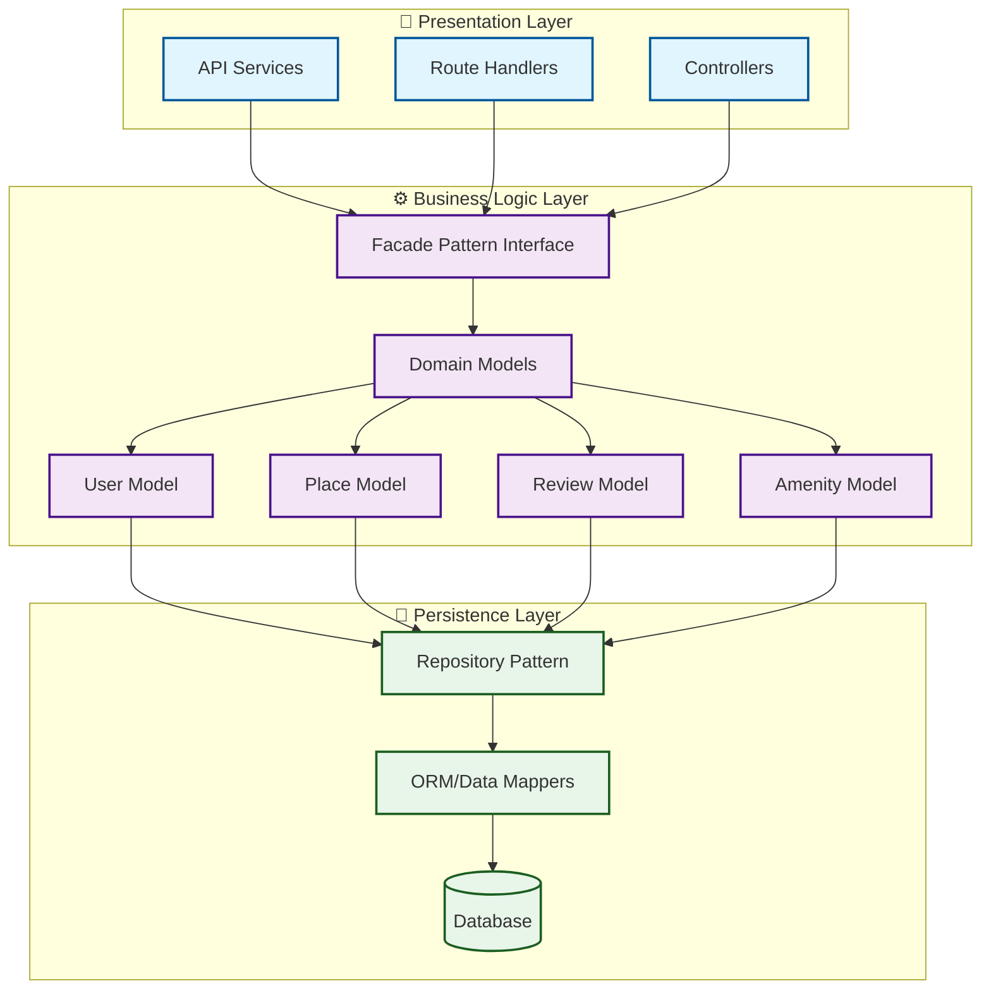
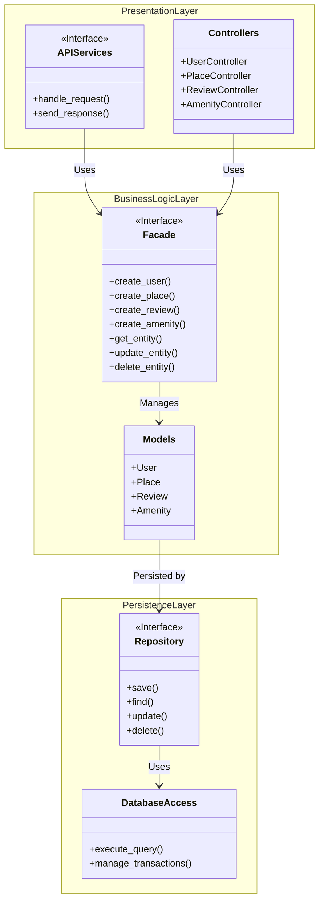

# Task 0: High-Level Package Diagram

## Overview
This diagram illustrates the three-layer architecture of the HBnB Evolution application, demonstrating the separation of concerns and communication patterns between layers using the Facade design pattern.

## Architecture Layers

### 1. Presentation Layer (Services & API)
- **Responsibility**: Handles all user interactions and HTTP requests
- **Components**: RESTful API endpoints, Request/Response handlers
- **Communication**: Interacts with Business Logic via Facade pattern

### 2. Business Logic Layer (Models)
- **Responsibility**: Contains core business rules and domain models
- **Components**: Entity models (User, Place, Review, Amenity), Business rules validation
- **Communication**: Receives requests from Presentation, communicates with Persistence

### 3. Persistence Layer (Database)
- **Responsibility**: Manages data storage and retrieval
- **Components**: Database operations, Data access objects, ORM mappings
- **Communication**: Provides data to Business Logic layer

## Facade Pattern Implementation
The Facade pattern provides a unified interface that:
- Simplifies communication between layers
- Reduces coupling and dependencies
- Centralizes business logic access
- Improves maintainability and testability

## Package Diagram

## Alternative Detailed Package Diagram

## Key Benefits of This Architecture

### Separation of Concerns
- Each layer has a single, well-defined responsibility
- Changes in one layer don't ripple through others
- Easier to test and maintain

### Facade Pattern Advantages
- **Simplified Interface**: Single entry point for business logic
- **Decoupling**: Presentation layer doesn't know about persistence details
- **Flexibility**: Easy to swap implementations without affecting clients
- **Centralized Logic**: Business rules are consolidated in one place

### Scalability
- Layers can be scaled independently
- Easy to add new features without disrupting existing code
- Clear boundaries for team collaboration

## Communication Flow Example

1. **Client Request** → API Services (Presentation Layer)
2. **API Services** → Facade (Business Logic Layer)
3. **Facade** → Models (Business Logic Layer)
4. **Models** → Repository (Persistence Layer)
5. **Repository** → Database (Persistence Layer)
6. **Response flows back** through the same path

## Implementation Notes

- All inter-layer communication goes through well-defined interfaces
- The Facade acts as a gatekeeper, enforcing business rules before data operations
- Persistence layer is completely isolated from presentation concerns
- This architecture supports easy migration to microservices if needed

---

**Created by:** Norah Mohammed Alskran  
**Project:** HBnB Evolution - Part 1  
**Date:** December 2025
