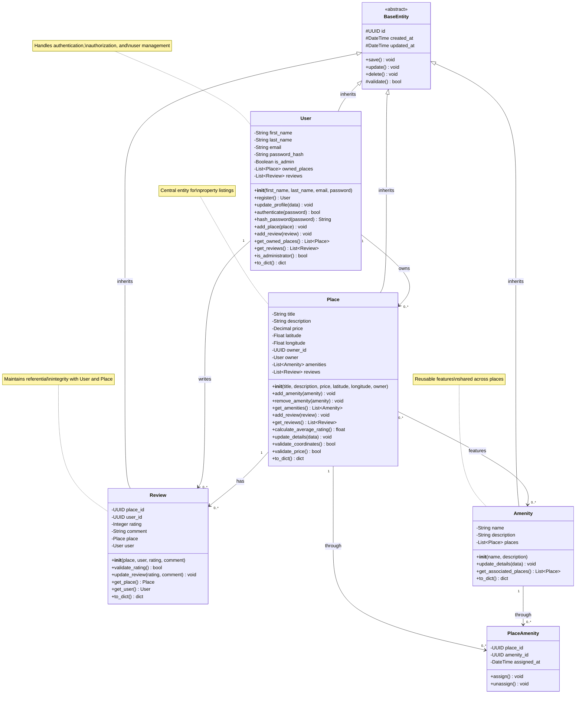
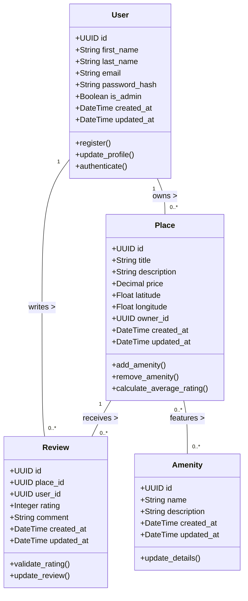

# Task 1: Detailed Class Diagram for Business Logic Layer

## Overview
This diagram represents the complete Business Logic layer of the HBnB Evolution application, showcasing all entities, their attributes, methods, and relationships according to SOLID principles and object-oriented design best practices.

## Business Rules Summary

### Entity Requirements
- **Unique Identification**: All entities use UUID4 for unique IDs
- **Audit Trail**: All entities track creation and update timestamps
- **Data Integrity**: Relationships enforce referential integrity
- **Validation**: All entities validate data before persistence

## Detailed Class Diagram


## Alternative Simplified View


## Detailed Entity Specifications

### 1. User Entity

#### Attributes
| Attribute | Type | Constraints | Description |
|-----------|------|-------------|-------------|
| id | UUID4 | Primary Key, Unique, Auto-generated | Unique identifier |
| first_name | String(50) | Not Null, Min 2 chars | User's first name |
| last_name | String(50) | Not Null, Min 2 chars | User's last name |
| email | String(120) | Unique, Not Null, Email format | User's email address |
| password_hash | String(128) | Not Null | Hashed password (bcrypt) |
| is_admin | Boolean | Default: False | Administrative privileges flag |
| created_at | DateTime | Auto-generated | Account creation timestamp |
| updated_at | DateTime | Auto-updated | Last modification timestamp |

#### Methods
- `register()`: Creates new user account with validation
- `update_profile(data)`: Updates user information
- `authenticate(password)`: Verifies password against hash
- `hash_password(password)`: Generates bcrypt hash
- `add_place(place)`: Associates owned place
- `add_review(review)`: Associates written review
- `to_dict()`: Serializes to dictionary

#### Business Rules
- Email must be unique across all users
- Password must be hashed before storage (never store plain text)
- Users can own multiple places
- Users can write multiple reviews
- Admin status affects system permissions

---

### 2. Place Entity

#### Attributes
| Attribute | Type | Constraints | Description |
|-----------|------|-------------|-------------|
| id | UUID4 | Primary Key, Unique, Auto-generated | Unique identifier |
| title | String(100) | Not Null, Min 5 chars | Place title/name |
| description | Text | Not Null, Max 1000 chars | Detailed description |
| price | Decimal(10,2) | Not Null, > 0 | Price per night |
| latitude | Float | Not Null, Range: -90 to 90 | Geographic latitude |
| longitude | Float | Not Null, Range: -180 to 180 | Geographic longitude |
| owner_id | UUID4 | Foreign Key → User.id, Not Null | Reference to owner |
| created_at | DateTime | Auto-generated | Listing creation timestamp |
| updated_at | DateTime | Auto-updated | Last modification timestamp |

#### Methods
- `add_amenity(amenity)`: Associates amenity with place
- `remove_amenity(amenity)`: Removes amenity association
- `get_amenities()`: Returns list of amenities
- `add_review(review)`: Associates new review
- `calculate_average_rating()`: Computes average from all reviews
- `validate_coordinates()`: Ensures valid lat/long values
- `validate_price()`: Ensures price is positive
- `to_dict()`: Serializes to dictionary

#### Business Rules
- Each place must have exactly one owner
- Price must be positive decimal value
- Coordinates must be valid geographic values
- Places can have zero or more amenities
- Places can have zero or more reviews
- Average rating is calculated from all reviews

---

### 3. Review Entity

#### Attributes
| Attribute | Type | Constraints | Description |
|-----------|------|-------------|-------------|
| id | UUID4 | Primary Key, Unique, Auto-generated | Unique identifier |
| place_id | UUID4 | Foreign Key → Place.id, Not Null | Reference to reviewed place |
| user_id | UUID4 | Foreign Key → User.id, Not Null | Reference to reviewer |
| rating | Integer | Not Null, Range: 1-5 | Star rating |
| comment | Text | Not Null, Max 500 chars | Review text |
| created_at | DateTime | Auto-generated | Review submission timestamp |
| updated_at | DateTime | Auto-updated | Last modification timestamp |

#### Methods
- `validate_rating()`: Ensures rating is between 1-5
- `update_review(rating, comment)`: Updates existing review
- `get_place()`: Returns associated place object
- `get_user()`: Returns associated user object
- `to_dict()`: Serializes to dictionary

#### Business Rules
- Each review is associated with exactly one place
- Each review is written by exactly one user
- Rating must be integer between 1 and 5 (inclusive)
- Users can write multiple reviews (different places)
- One user can review the same place multiple times (update existing)

---

### 4. Amenity Entity

#### Attributes
| Attribute | Type | Constraints | Description |
|-----------|------|-------------|-------------|
| id | UUID4 | Primary Key, Unique, Auto-generated | Unique identifier |
| name | String(50) | Not Null, Unique | Amenity name |
| description | Text | Optional, Max 200 chars | Amenity description |
| created_at | DateTime | Auto-generated | Creation timestamp |
| updated_at | DateTime | Auto-updated | Last modification timestamp |

#### Methods
- `update_details(data)`: Updates amenity information
- `get_associated_places()`: Returns all places with this amenity
- `to_dict()`: Serializes to dictionary

#### Business Rules
- Amenity names must be unique
- Amenities are reusable across multiple places
- Deleting an amenity removes associations but not places
- Multiple places can share the same amenity

---

## Relationships Explained

### 1. User → Place (One-to-Many)
- **Type**: Composition/Ownership
- **Multiplicity**: 1 User can own 0..* Places
- **Implementation**: Place.owner_id references User.id
- **Cascade**: Deleting user may delete their places (business decision)

### 2. User → Review (One-to-Many)
- **Type**: Association
- **Multiplicity**: 1 User can write 0..* Reviews
- **Implementation**: Review.user_id references User.id
- **Cascade**: Deleting user typically deletes their reviews

### 3. Place → Review (One-to-Many)
- **Type**: Association
- **Multiplicity**: 1 Place can have 0..* Reviews
- **Implementation**: Review.place_id references Place.id
- **Cascade**: Deleting place deletes all its reviews

### 4. Place ↔ Amenity (Many-to-Many)
- **Type**: Association
- **Multiplicity**: Many Places can have Many Amenities
- **Implementation**: PlaceAmenity junction table
- **Cascade**: Deleting place removes associations; deleting amenity removes associations

---

## SOLID Principles Implementation

### Single Responsibility Principle (SRP)
- Each entity class has one primary responsibility
- User: Manages user data and authentication
- Place: Manages property listings
- Review: Manages ratings and feedback
- Amenity: Manages reusable features

### Open/Closed Principle (OCP)
- BaseEntity provides extensible foundation
- New entity types can extend BaseEntity without modification
- Methods can be overridden for specialized behavior

### Liskov Substitution Principle (LSP)
- All entities can be treated as BaseEntity
- Derived classes maintain base class contracts
- Polymorphic operations work on any entity type

### Interface Segregation Principle (ISP)
- Entities implement only needed methods
- No entity is forced to depend on unused methods
- Clean, focused interfaces

### Dependency Inversion Principle (DIP)
- Entities depend on abstractions (BaseEntity)
- High-level business logic doesn't depend on low-level details
- Repository pattern will provide data access abstraction

---

## Design Patterns Used

### 1. Template Method Pattern
- BaseEntity provides common structure
- Derived classes implement specific validation

### 2. Repository Pattern (Implied)
- Each entity will have corresponding repository
- Abstracts data access from business logic

### 3. Factory Pattern (Future)
- Entity creation can be centralized
- Ensures proper initialization and validation

---

## Validation Rules

### User Validation
```python
- Email format: RFC 5322 compliant
- Password: Min 8 chars, contains uppercase, lowercase, number
- Names: Alphabetic characters only, 2-50 chars
```

### Place Validation
```python
- Title: 5-100 characters
- Description: Max 1000 characters
- Price: Positive decimal, max 2 decimal places
- Latitude: -90.0 to 90.0
- Longitude: -180.0 to 180.0
```

### Review Validation
```python
- Rating: Integer 1-5 only
- Comment: Max 500 characters, not empty
- User cannot review own place
```

### Amenity Validation
```python
- Name: Unique, 3-50 characters
- Description: Max 200 characters
```

---

## Example Usage Scenarios

### Creating a User and Place
```python
# Create user
user = User(
    first_name="Tariq",
    last_name="Almutairi",
    email="tariq@ib.sa",
    password="SecurePass123"
)
user.register()

# Create place
place = Place(
    title="Luxury Villa in Riyadh",
    description="Beautiful 5-bedroom villa in diplomatic quarter",
    price=1500.00,
    latitude=24.7136,
    longitude=46.6753,
    owner=user
)
place.save()

# Add amenities
wifi = Amenity(name="WiFi", description="High-speed internet")
pool = Amenity(name="Pool", description="Outdoor swimming pool")
place.add_amenity(wifi)
place.add_amenity(pool)
```

### Creating a Review
```python
# Another user reviews the place
reviewer = User.get_by_email("norah@example.sa")
review = Review(
    place=place,
    user=reviewer,
    rating=5,
    comment="Amazing property! Highly recommend."
)
review.save()

# Calculate average rating
avg_rating = place.calculate_average_rating()  # Returns 5.0
```

---

## Future Enhancements

### Phase 2 Considerations
- Add Booking entity (User books Place for dates)
- Add Payment entity (Track transactions)
- Add Location entity (City, Country hierarchy)
- Add Image entity (Multiple images per place)

### Scalability Features
- Implement caching for frequently accessed data
- Add search/filter capabilities
- Implement soft delete (mark as deleted vs. actual deletion)
- Add versioning for entity changes

---

**Created by:** Tariq Rashed Almutairi  
**Company:** Integrated Business for Technology and Communications (IB)  
**Project:** HBnB Evolution - Part 1  
**Date:** December 2025  
**Version:** 1.0
