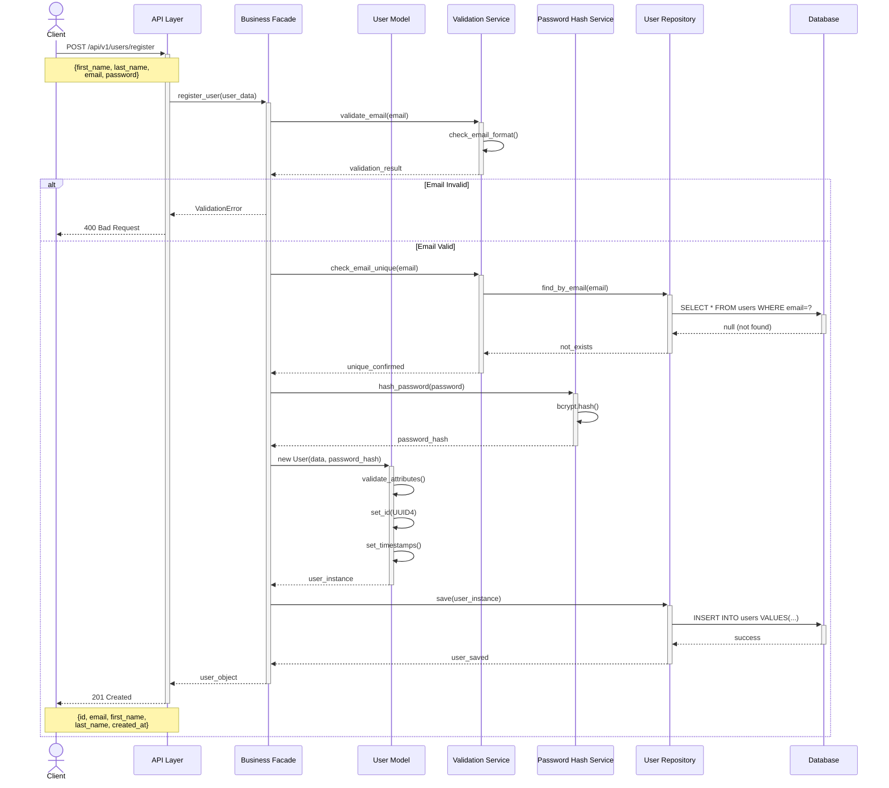
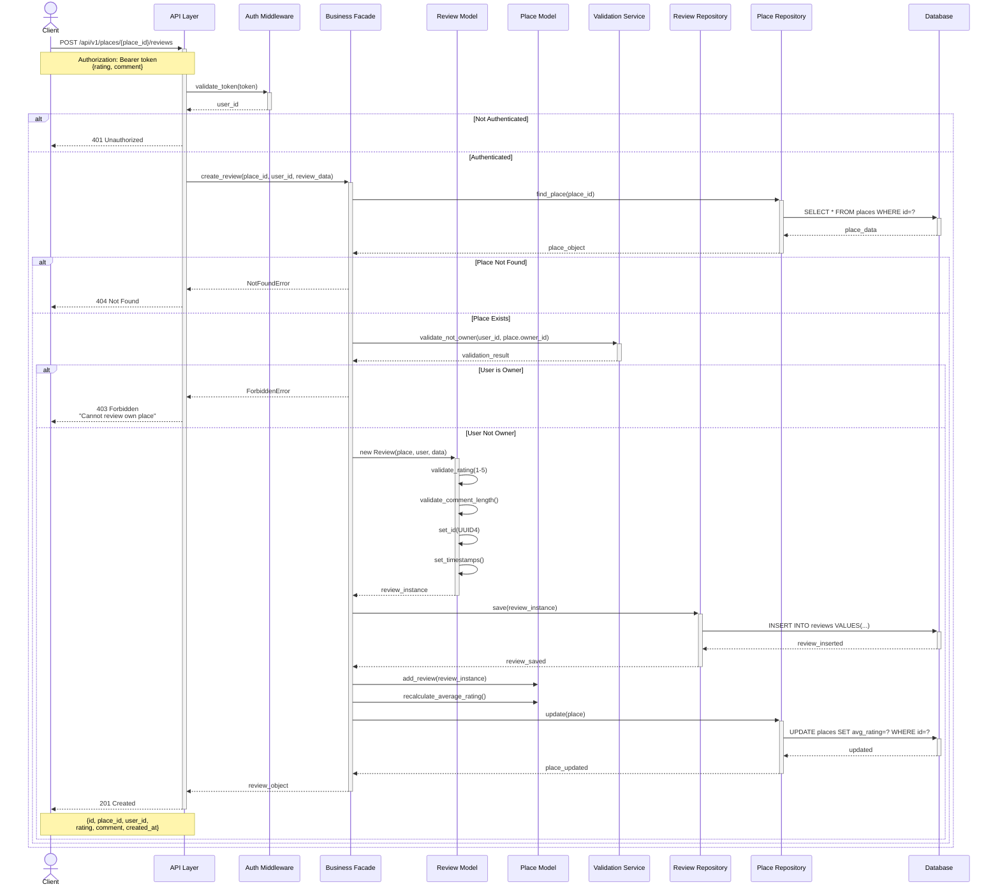
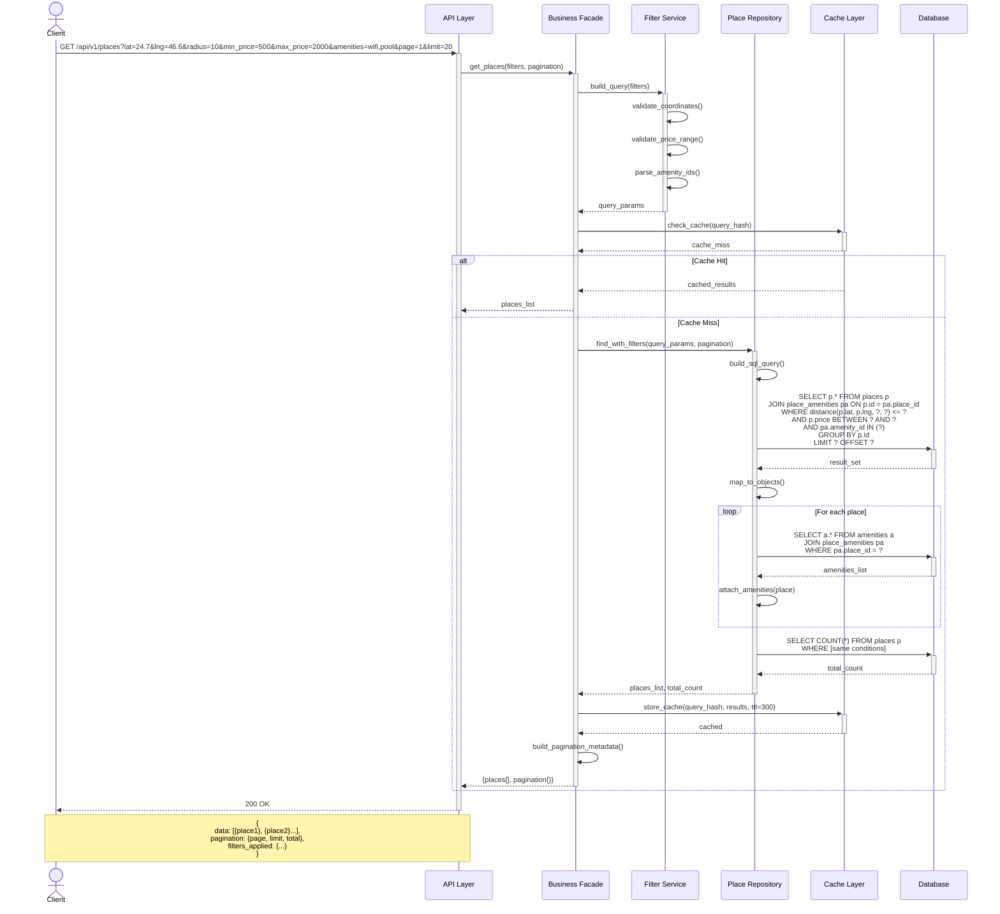

# Task 2: Sequence Diagrams for API Calls

## Overview
This document presents sequence diagrams for four critical API operations in the HBnB Evolution application. Each diagram illustrates the complete interaction flow from the client request through all three architectural layers (Presentation, Business Logic, Persistence) and back.

## API Call 1: User Registration

### Description
A new user registers for an account in the system. This process involves validation, password hashing, and database persistence.

### Sequence Diagram



### Flow Description

1. **Client Request**: Client sends POST request with user registration data
2. **API Reception**: API layer receives and forwards to Business Facade
3. **Email Validation**: 
   - Check email format (RFC 5322)
   - Verify email uniqueness in database
4. **Password Security**: Hash password using bcrypt
5. **User Creation**: Instantiate User model with validated data
6. **Persistence**: Save user to database via repository
7. **Response**: Return created user data (excluding password)

### Error Scenarios
- Invalid email format → 400 Bad Request
- Duplicate email → 409 Conflict
- Weak password → 400 Bad Request
- Database error → 500 Internal Server Error

---

## API Call 2: Place Creation

### Description
An authenticated user creates a new place listing. This requires authentication, validation of coordinates and price, and amenity associations.

### Sequence Diagram

```mermaid
sequenceDiagram
    actor Client
    participant API as API Layer
    participant Auth as Auth Middleware
    participant Facade as Business Facade
    participant Place as Place Model
    participant User as User Model
    participant Amenity as Amenity Model
    participant PlaceRepo as Place Repository
    participant AmenityRepo as Amenity Repository
    participant DB as Database

    Client->>+API: POST /api/v1/places
    Note over Client,API: Authorization: Bearer token<br/>{title, description, price,<br/>lat, lng, amenity_ids}
    
    API->>+Auth: validate_token(token)
    Auth->>Auth: decode_jwt(token)
    Auth->>+DB: verify_user_exists(user_id)
    DB-->>-Auth: user_found
    Auth-->>-API: user_authenticated(user_id)
    
    alt Authentication Failed
        API-->>Client: 401 Unauthorized
    else Authenticated
        API->>+Facade: create_place(place_data, user_id)
        
        Facade->>+User: get_user(user_id)
        Facade->>+PlaceRepo: find_user(user_id)
        PlaceRepo->>+DB: SELECT * FROM users WHERE id=?
        DB-->>-PlaceRepo: user_data
        PlaceRepo-->>-Facade: user_object
        Facade-->>-User: user_instance
        
        Facade->>+Place: new Place(data, owner)
        Place->>Place: validate_coordinates()
        Place->>Place: validate_price()
        Place->>Place: set_id(UUID4)
        Place->>Place: set_timestamps()
        Place-->>-Facade: place_instance
        
        loop For each amenity_id
            Facade->>+AmenityRepo: find_amenity(amenity_id)
            AmenityRepo->>+DB: SELECT * FROM amenities WHERE id=?
            DB-->>-AmenityRepo: amenity_data
            AmenityRepo-->>-Facade: amenity_object
            Facade->>Place: add_amenity(amenity_object)
        end
        
        Facade->>+PlaceRepo: save(place_instance)
        PlaceRepo->>+DB: BEGIN TRANSACTION
        DB-->>-PlaceRepo: transaction_started
        PlaceRepo->>+DB: INSERT INTO places VALUES(...)
        DB-->>-PlaceRepo: place_inserted
        PlaceRepo->>+DB: INSERT INTO place_amenities VALUES(...)
        DB-->>-PlaceRepo: associations_created
        PlaceRepo->>+DB: COMMIT
        DB-->>-PlaceRepo: committed
        PlaceRepo-->>-Facade: place_saved
        
        Facade-->>-API: place_object
        API-->>-Client: 201 Created
        Note over Client,API: {id, title, price, owner_id,<br/>amenities[], created_at}
    end
```

### Flow Description

1. **Authentication**: Validate JWT token and user existence
2. **User Verification**: Retrieve user object from database
3. **Place Validation**: 
   - Validate geographic coordinates (-90/90, -180/180)
   - Validate price (positive decimal)
   - Validate required fields
4. **Amenity Association**: 
   - Verify each amenity exists
   - Create many-to-many associations
5. **Transactional Save**: 
   - Begin database transaction
   - Insert place record
   - Insert amenity associations
   - Commit transaction
6. **Response**: Return created place with amenities

### Error Scenarios
- Invalid/expired token → 401 Unauthorized
- User not found → 404 Not Found
- Invalid coordinates → 400 Bad Request
- Negative price → 400 Bad Request
- Amenity not found → 404 Not Found
- Database constraint violation → 409 Conflict

---

## API Call 3: Review Submission

### Description
An authenticated user submits a review for a place they visited. The system validates the rating, ensures the place exists, and prevents users from reviewing their own properties.

### Sequence Diagram



### Flow Description

1. **Authentication**: Validate user token
2. **Place Verification**: Ensure place exists in database
3. **Ownership Check**: Prevent users from reviewing own places
4. **Review Validation**:
   - Rating must be 1-5
   - Comment within length limits
5. **Review Creation**: Instantiate and validate review
6. **Rating Update**: Recalculate place's average rating
7. **Persistence**: Save review and update place statistics
8. **Response**: Return created review

### Business Rules
- Users cannot review their own places
- Rating must be integer between 1 and 5
- Comment is required and limited to 500 characters
- One user can submit multiple reviews for same place (updates existing)

### Error Scenarios
- Unauthenticated → 401 Unauthorized
- Place not found → 404 Not Found
- User reviewing own place → 403 Forbidden
- Invalid rating → 400 Bad Request
- Comment too long → 400 Bad Request

---

## API Call 4: Fetching List of Places

### Description
Retrieve a paginated and filtered list of places based on search criteria such as location, price range, and amenities.

### Sequence Diagram



### Flow Description

1. **Request Parsing**: Extract and validate query parameters
2. **Filter Validation**:
   - Validate coordinates and radius
   - Validate price range
   - Parse amenity filters
3. **Cache Check**: Look for cached results
4. **Database Query** (if cache miss):
   - Build complex SQL with joins
   - Apply geographic distance calculation
   - Apply price filters
   - Filter by amenities (many-to-many)
   - Apply pagination
5. **Eager Loading**: Fetch associated amenities for each place
6. **Count Query**: Get total matching records for pagination
7. **Cache Storage**: Store results for future requests
8. **Response**: Return paginated results with metadata

### Query Parameters

| Parameter | Type | Description | Default |
|-----------|------|-------------|---------|
| lat | Float | Center latitude | Required |
| lng | Float | Center longitude | Required |
| radius | Integer | Search radius (km) | 10 |
| min_price | Decimal | Minimum price | 0 |
| max_price | Decimal | Maximum price | No limit |
| amenities | String | Comma-separated IDs | None |
| page | Integer | Page number | 1 |
| limit | Integer | Results per page | 20 |

### Optimization Strategies

1. **Caching**: 5-minute TTL for search results
2. **Database Indexes**:
   - Geographic index on (latitude, longitude)
   - Index on price
   - Composite index on (created_at, price)
3. **Eager Loading**: Fetch amenities in batch to avoid N+1 queries
4. **Query Optimization**: Use EXISTS instead of IN for large amenity lists

### Response Structure
```json
{
  "data": [
    {
      "id": "uuid-here",
      "title": "Luxury Villa",
      "price": 1500.00,
      "latitude": 24.7136,
      "longitude": 46.6753,
      "amenities": [
        {"id": "uuid", "name": "WiFi"},
        {"id": "uuid", "name": "Pool"}
      ],
      "average_rating": 4.5,
      "owner": {
        "id": "uuid",
        "first_name": "Tariq"
      }
    }
  ],
  "pagination": {
    "page": 1,
    "limit": 20,
    "total_results": 45,
    "total_pages": 3
  },
  "filters_applied": {
    "location": {"lat": 24.7, "lng": 46.6, "radius": 10},
    "price_range": {"min": 500, "max": 2000},
    "amenities": ["wifi", "pool"]
  }
}
```

---

## Summary of Interactions

### Common Patterns Across All APIs

1. **Authentication Layer**: 
   - All modify operations require authentication
   - Read operations may be public or authenticated

2. **Validation Layer**:
   - Input validation at API layer (format, types)
   - Business validation at Facade layer (rules, constraints)
   - Database validation (constraints, foreign keys)

3. **Error Handling**:
   - Consistent HTTP status codes
   - Structured error responses
   - Proper exception propagation

4. **Transaction Management**:
   - ACID compliance for write operations
   - Rollback on failures
   - Consistent state maintenance

5. **Response Format**:
   - Consistent JSON structure
   - Include relevant related data
   - Exclude sensitive information (passwords)

---

## Performance Considerations

### Database Optimization
- Use connection pooling
- Implement prepared statements
- Apply proper indexing strategy
- Use EXPLAIN ANALYZE for query optimization

### Caching Strategy
- Cache frequently accessed data (place listings)
- Invalidate cache on updates
- Use distributed cache (Redis) for scalability

### Asynchronous Operations
- Send email notifications asynchronously
- Process analytics in background
- Generate reports offline

---

## Security Measures

### Authentication
- JWT tokens with expiration
- Token refresh mechanism
- Secure password hashing (bcrypt, cost factor 12)

### Authorization
- Role-based access control
- Resource ownership verification
- Admin privilege checking

### Input Sanitization
- SQL injection prevention (parameterized queries)
- XSS protection (output encoding)
- CSRF token validation

### Rate Limiting
- Per-user API rate limits
- IP-based throttling
- Exponential backoff for failed attempts

---

**Created by:** Norah & Team  
**Project:** HBnB Evolution - Part 1  
**Date:** December 2025  
**Version:** 1.0
